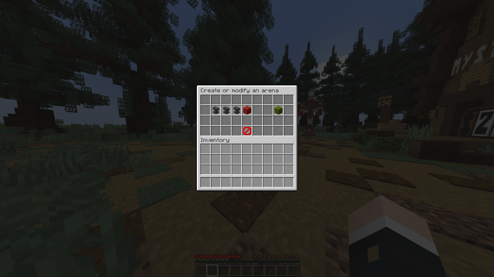

# Creating Lobbies and Arenas
In order to set up a game, you need to set up both a lobby and an arena. Both lobbies and arenas are stored in schematics.
There is a "host-world" for both the lobby and arena, which are what the schematic is copied from when creating new
lobbies or arenas.

## Using the Demo
Murder Run provides you with an example lobby and arena that you can use! Run the `/murder demo` command, which will
prompt you with a message. Run the command again to load the demo lobby and arena that you can use. They're named
TestLobby and TestArena.

```{note}
After loading the demo, you still need to spawn the NPC shops. You can see the note under #lobby-commands to figure out
how to spawn the NPCs in. To teleport to your demo world, I recommend using a world plugin such as [Multiverse](https://www.spigotmc.org/resources/multiverse-core.390/)
to configure your worlds. If not, you can always run the `/execute in <dimension> run tp <x> <y> <z>` command to teleport
to your specific dimension. This might be a bit hard to understand, but feel free to ask in the support Discord!
```

```{warning}
Any existing lobbies and arenas that have the name TestLobby and TestArena **will be overwritten**. This is meant to be
used for a fresh installation only for testing purposes!
```

## Recommended Way
The recommended way is to use a GUI to set up both. To use the GUI, run the `/murder gui` command, and click on each
specific item that you want to set up or not. You can also create games using the GUI. The rest of this guide will be 
dedicated to using solely commands



---

# Lobby Commands

## Setting Up a Lobby
To set up a lobby using commands, here are the steps needed:
1) Run the `/murder lobby set name <name>` command, where you replace <name> with your desired lobby name
2) Fly to your lobby spawn and run the `/murder lobby set spawn` to set the lobby spawn-point
3) Lobbies are 3D rectangular regions. Fly to the first corner and then run the `/murder lobby set first-corner` command
4) Fly directly to the opposite corner and then run the `/murder lobby set second-corner` command to define your region
5) Run the `/murder lobby create` command to create your new lobby

```{note}
After you create your lobby, you want to create NPC shops for the gadgets and abilities. There are four NPCs in total
(one NPC selling gadgets to killers, one NPC selling abilities to killers, one NPC selling gadgets to survivors, and
one NPC selling abilities to survivors). To spawn them, run the `/murder npc spawn <ability | gadget> <killer | survivor>`
commands. You're able to specify the skins and names via the `game.properties` and locale properties file respectively
(see [Configuring Murder Run](configuration.md)).
```

## Removing a Lobby
To remove your lobby, just run the `/murder lobby remove <name>`, where <name> is your lobby name. You can find the list
of all lobbies using the `/murder lobby list` command.

## Editing a Lobby
To edit a lobby, you would have to create a new lobby, but with the name of the same lobby that you want to edit. Follow
the exact same steps for setting up a lobby, and Murder Run will automatically replace the old version with the newly-edited
version that you just provided by running the `/murder lobby create` command.

---

# Arena Commands

## Setting Up an Arena
To set up an arena using commands, here are the steps needed:
1) Run the `/murder arena set name <name>` command, where you replace <name> with your desired arena name
2) Fly to your arena spawn and run the `/murder arena set spawn` to set the arena spawn-point 
3) Fly to your arena truck location `/murder arena set truck` to set the truck location
4) Lobbies are 3D rectangular regions. Fly to the first corner and then run the `/murder arena set first-corner` command
5) Fly directly to the opposite corner and then run the `/murder arena set second-corner` command to define your region
6) Now walk to all special item spawn locations, and run the `/murder arena set item add` to add your current location
as a possible item spawn. To remove, run the `/murder arena set item remove` command. And to list all your current
locations, run the `/murder arena set item list` command.
7) Run the `/murder lobby create` command to create your new lobby

## Removing an Arena
To remove your arena, just run the `/murder arena remove <name>`, where <name> is your arena name. You can find the list
of all arenas using the `/murder arena list` command.

## Editing an Arena
Unlike lobbies, you're able to copy over settings for a pre-configured arena. To do so, run the `/murder arena copy <name>`
command, where <name> is your desired arena name that you want to copy. After running this command, the arena's name,
locations, and everything will be transferred over. Modify what you need, and then run the `/murder arena create` to
create your new game.

Once you're done setting up an arena and lobby, take a look at starting games [here](game.md).