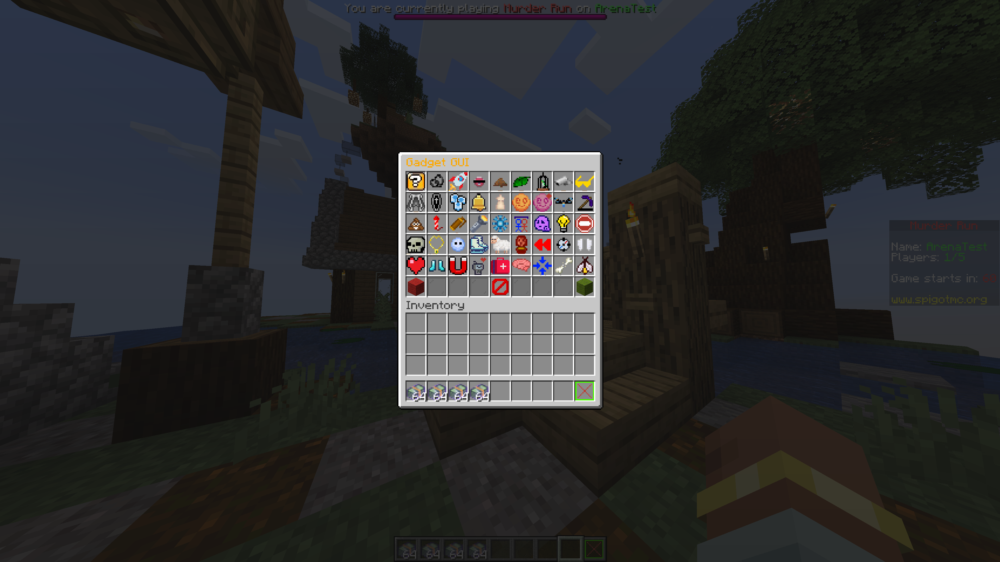

# Murder Run Documentation


```{note}
Connect to the plugin testing server `pulse.mcserver.us` to try Murder Run with your friends! There is no cost, and
it's completely free.
```

```{note}
Murder Run is free and open-source software licensed under the [GNU GPLv3](https://opensource.org/license/gpl-3-0)
License, the same license that Bukkit software and all inheritors must fall under.
```

## What is Murder Run?
If you are familiar with the game Dead by Daylight (DBD), you will be familiar with Murder Run. Murder Run is based off
the concept in DBD, an advanced game-mode revolving around two groups: killers and survivors. In a desolate map, survivors
must find all vehicle parts scattered everywhere and throw them back on the truck before the killers murder everyone or
the timer runs out.



Similar to Dead by Daylight's character system, Murder Run includes many gadgets and abilities. Currently, there are 
over 100+ gadgets and abilities combined that the player can choose from. Each gadget and ability has many configuration 
options that you can configure to your own heart's desire.

---

Murder Run contains so many features, too many to list in this one page. If you have questions about any feature, visit
the support [Discord](https://discord.gg/cUMB6kCsh6) for help!

Once you're done reading, take a look at the [setup](setup.md) or [game](creation) page!